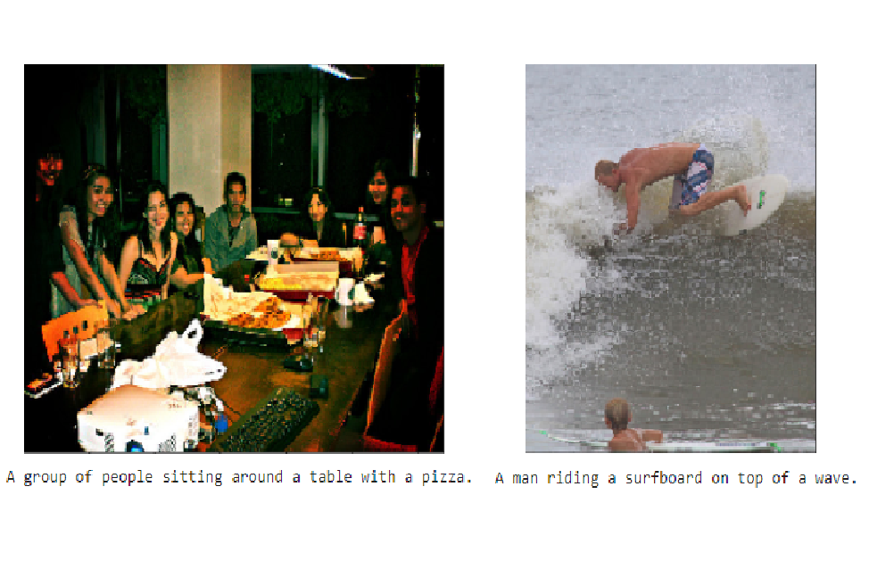

# Computer Vision Nanodegree:
[](https://www.udacity.com/course/computer-vision-nanodegree--nd891)<br>
Computer Vision Nanodegree Notes and Projects [Computer Vision Nanodegree](https://www.udacity.com/course/computer-vision-nanodegree--nd891).


# Nanodegree Overview:
For more details about the program please have a look at the Nanodegree [Syllabus](/data/CVND_Syllabus.pdf) or visit [Computer Vision Nanodegree](https://www.udacity.com/course/computer-vision-nanodegree--nd891).


# Projects:


<table>
    <tr>
        <td valign="center"></td>
        <td valign="top">
        <p><h2>
        <a href="projects/facial_keypoint_detection">P1: Facial Keypoints Detection</a>
        </h2></p>
        Use image processing techniques and deep learning techniques to detect faces in an image and find facial keypoints, such as the position of the eyes, nose, and mouth on a face.</td>
    </tr>
    <tr>
        <td valign="center"></td>
        <td valign="top">
        <p><h2>
        <a href="projects/image_captioning">P2: Image Captioning</a>
        </h2></p>
        TODO
        </td>
    </tr>
 </table>


# Notes:

<table>
  <tr>
    <td valign="center"></td>
    <td valign="top">
    <p><h2><a href="notes/Notes_M1_Classical_Computer_Vision.ipynb">Module 1: Classical Computer Vision</a>
    </h2></p>
    Utilise basic Classical Computer Vision techniques such as Image Filtering, Masking, Canny Edge Detection, Hough Lines, Fast Fourier Transform.</td>
  </tr>
  <tr>
    <td valign="center"></td>
    <td valign="top">
    <p><h2><a href="notes/Templates_PyTorch_MNIST_CNN.ipynb">PyTorch Templates - CNN MNIST</a>
    </h2></p>
    TODO</td>
  </tr>

 </table>


# Setup:
Setup conda environment for Computer Vision Nanodegree using [official guide](https://github.com/udacity/CVND_Exercises) or instruction below:

```
# 1. Create conda environment and activate it
conda create --name cv-nd python=3.6
activate cv-nd

# 2. Add environment to Jupyter Kernels:
conda install pip
conda install ipykernel
python -m ipykernel install --user --name <cv-nd> --display-name "<cv-nd>"

# 3. Install PyTorch and OpenCV
pip install opencv-python
conda install -c pytorch pytorch
conda install -c pytorch torchvision

# 4. Install other required packages:
pip install -r requirements.txt

```