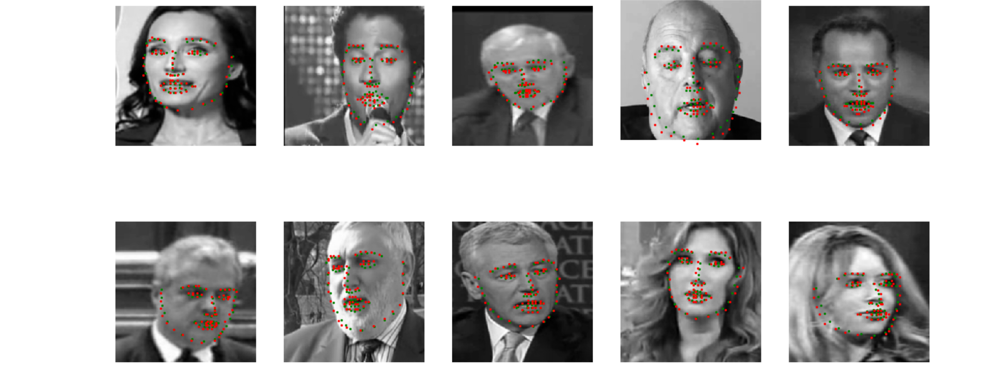
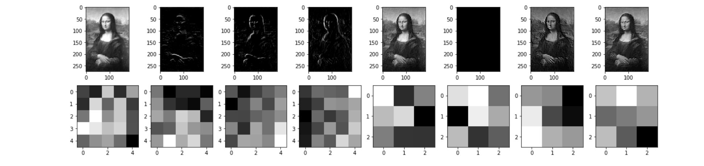
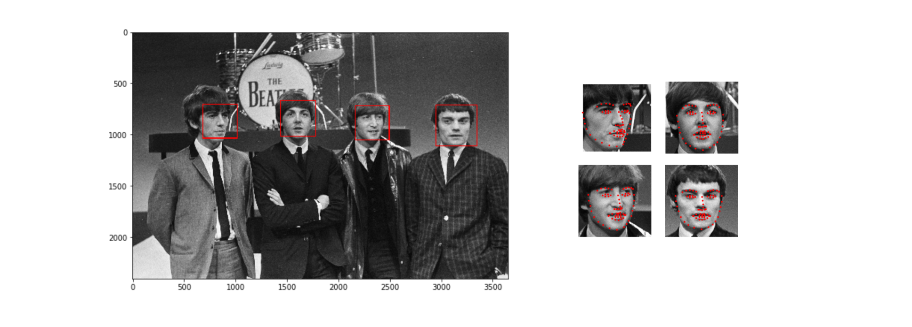

# Facial Keypoints Detection Project

## Project Overview

In this project, we will combine computer vision and deep learning techniques to build a facial keypoints detection system. Facial keypoints include points around the eyes, nose, and mouth on a face and are used in many applications. The applications of facial keypoints include: facial tracking, facial pose recognition, facial filters, and emotion recognition.

## Notebook 1: Data Loading and Visualisation

	
	
<i>Faces from dataset with corresponding Keypoints overlay</i>

## Notebook 2: Network, Training, Testing, Visualisation

	
	
<i>Ground truth and predicted keypoints</i>

	
	
<i> Learned CNN filters and corresponding filtered image</i>

## Notebook 3: Detect Faces and Find Keypoints

	
	
<i>Face detection and keypoints localisation</i>

<!-- ## Notebook 4: Using keypoints to overlay images
TODO

	
	
<i>Face detection and keypoints localisation</i>

 -->

## Dataset and Setup:

Used Dataset and detailed setup steps are available on the Udacity official Github project website [P1_Facial_Keypoints](https://github.com/udacity/P1_Facial_Keypoints)
