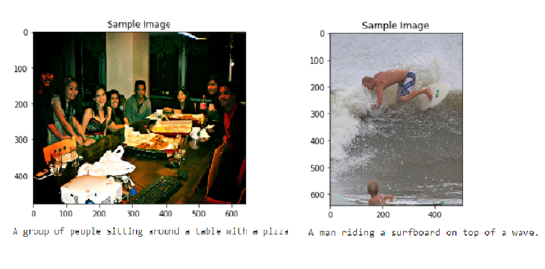

# Image Captioning Project
[](https://www.udacity.com/course/computer-vision-nanodegree--nd891)<br>


## Project Overview
The Microsoft **C**ommon **O**bjects in **CO**ntext dataset is a large-scale dataset commonly used to train and benchmark object detection, segmentation, and captioning algorithms.
This collection of notebooks proposes solution to Udacity Computer Vision Nanodegree - Image Captioning project.

## Results
<div style="text-align:center">
	
	<p><i>Example of correct image captioning</i></p>
</div>

<div style="text-align:center">
	
	<p><i>Example of incorrect image captioning</i></p>
</div>

## COCO Folder Structure
This repository does not include the dataset itself to download the dataset please visit [COCO download](http://cocodataset.org/#download) link and follow the location convention and the dataset structure presented below.

```
# http://cocodataset.org/#download

data
├── vocab.pkl
└── opt
    └── cocoapi
        ├── annotations     # http://images.cocodataset.org/annotations/annotations_trainval2014.zip
        │   ├── captions_train2014.json
        │   ├── captions_val2014.json
        │   ├── image_info_test2014.json
        │   ├── instances_train2014.json
        │   ├── instances_val2014.json
        │   ├── person_keypoints_train2014.json
        │   └── person_keypoints_val2014.json
        └── images
            ├─── test2014   # http://images.cocodataset.org/zips/test2014.zip
            │    └── ...
            └─── test2014   # http://images.cocodataset.org/zips/train2014.zip
                 └── ...
```

